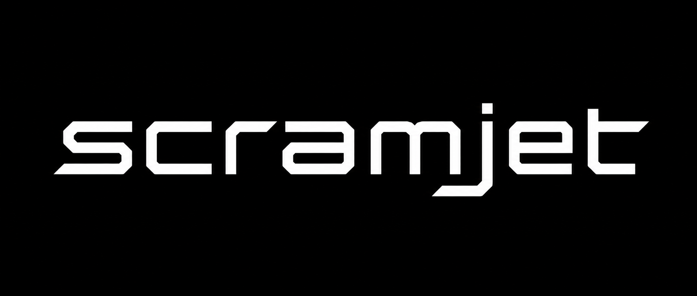

# Scramjet

<p align="center">
  
</p>

A high-velocity harness for agentic development. Uses the [Pi](https://github.com/earendil-works/pi-mono) runtime.

## Status

Scramjet is in active early development. The harness works and is used daily, but:

- The command-set format is not yet stable for third-party authoring
- Breaking changes may land between minor versions
- The bundled Scramjet and Mach 12 commands evolve alongside the harness

## Background

Scramjet grew out of [Mach 10](https://github.com/LeanAndMean/mach10), a development methodology for agentic coding. Mach 10 addresses the core challenge of scaling AI-assisted development to larger codebases: managing finite context windows, ensuring due diligence through structured review cycles, and using GitHub as persistent memory so multiple developers (and agents) can collaborate across sessions. It works — but the user experience of running a 10–15 step workflow in a CLI harness was friction-heavy: copy the suggested next command, clear the session, paste, wait, repeat.

Scramjet started as a way to eliminate that friction, but it became clear that the Mach 10 workflow was a special case of a general problem: any team's recurring processes can be codified as a command set, and any command set benefits from composability and chaining. Scramjet is the harness that makes this possible.

## Quick start

```sh
npm install -g @leanandmean/scramjet
scramjet
```

`scramjet` is a standalone CLI that uses Pi as its runtime. All Pi flags (`--help`, `--print`, `--resume`, etc.) work unchanged.

Scramjet ships with two command sets: the product-owned **Scramjet** operational set and **Mach 12**, a starting point with ten top-level commands for the issue → plan → review → implement → PR → ship methodology. The harness also supports your own processes: drop command files into `$XDG_DATA_HOME/scramjet/` (global) or `.scramjet/` (per-project) and they become a command set.

Try it:

```
> /mach12:issue-plan 55          # replace 55 with a GitHub issue number from your repo
```

## Why

Working with a coding agent, you notice yourself asking for the same kind of thing repeatedly — refining the wording each time until it stabilizes. At that point it should be a *command*: something you invoke without retyping, that captures what you've learned about how to do it well.

Once you have a few related commands, two patterns appear:

1. **Some commands show up as subroutines inside others.** "Find the contribution guidelines" or "commit, push, and post a progress comment" gets embedded in multiple higher-level flows. Without a way to call one command from another, these routines get copy-pasted across commands — and drift.

2. **Some commands naturally follow others.** Planning leads to review or implementation. Implementation leads to PR creation. Review leads to fixes or merge. You start to see the shape of a workflow, but after every step you're still manually clearing the session, typing the next command with the right arguments, and waiting.

Scramjet supports both patterns:

- **Composability.** Commands invoke other commands as subroutines — write common routines once, call them from anywhere.
- **Chaining.** Commands declare what should come next. Scramjet validates the options and shows a selector. With `/autopilot on`, the recommendation auto-selects after a brief countdown. With `/autopilot off`, you pick manually. Either way, Escape returns to plain Pi.

```
> /mach12:issue-plan 55
  [agent works, asks you about architecture, you pick an approach, plan posted]

  Select next step
  > 0: /mach12:issue-review 55 [recommended]
       Reviews the plan before implementation.
    1: /mach12:issue-implement 55 2
       The plan is straightforward enough to continue.
  ←→ model • ↑↓ navigate • enter select • esc cancel • auto-selects recommendation in 3s

  [fresh session starts, runs issue-review]
  [agent works, asks you questions, you answer, review posted]

  Select next step
  > 0: /mach12:issue-implement 55 1 [recommended]
       Stage 1 is ready to build.
  ←→ model • ↑↓ navigate • enter select • esc cancel • auto-selects recommendation in 3s

  [continues through the entire methodology...]
```

No workflow engine, no queue, no DAG, no state machine. The workflow emerges from what each command declares as its next step.

## Design

### Emergent workflows

Scramjet doesn't define workflows. Each command independently declares its own next step — an edge, not a graph. The workflow is the union of those edges:

- Any set of commands with next-step declarations is automatically a workflow
- You don't register workflows, create config files, or maintain a separate DAG
- Different command sets coexist without knowing about each other
- Adding a step means editing one command's declaration

### Never locked in

Scramjet is an autopilot, not a conveyor belt. At any transition:

- **Escape** dismisses the selector — you're back in normal Pi
- **Left/right arrows** cycle the model for the next command; **up/down + Enter** choose the option — any interaction cancels the countdown
- **Run a different command** — Scramjet doesn't interfere
- **Close the terminal** — no workflow state to corrupt

There is no "workflow mode" to enter or exit. You're always just using Pi. Scramjet is invisible when it has nothing to suggest.

## Autonomy settings

By default, `/autopilot on` auto-accepts all recommended transitions and `/autopilot off` pauses at every one. Autonomy settings let you override this per edge — pin specific transitions to always chain or always pause, regardless of the global flag.

Run `/scramjet settings` to browse commands and edit autonomy overrides from the TUI. You can also edit `~/.config/scramjet/autonomy.yaml` (or `$XDG_CONFIG_HOME/scramjet/autonomy.yaml`) directly:

```yaml
edges:
  mach12:issue-implement:
    mach12:issue-implement: chain    # same command, next stage — keep going
    mach12:pr-create: pause          # major phase transition — stop here

  mach12:pr-pre-merge:
    mach12:pr-merge: chain           # trust the checklist
```

| Setting   | Behavior |
|-----------|----------|
| `chain`   | Auto-dispatch without selector or countdown, regardless of `/autopilot on\|off` |
| `pause`   | Always show selector without auto-select, regardless of `/autopilot on\|off` |
| (absent)  | Default behavior — follows `/autopilot on\|off` flag |

A `"*"` wildcard target applies to any command not explicitly listed under a source. `forced` transitions are not affected by edge settings.

The file is optional — without it, behavior is identical to today. Invalid command names in the config produce warnings on first use but never crash.

Command sets can also ship recommended settings via `autonomy-defaults.yaml` in the set directory. Recommendations are gap-fill only (never overwrite your config) and appear as an "Apply recommended settings" action in `/scramjet settings` when unapplied recommendations exist.

## Scramjet operational commands

The product-owned `scramjet` command set contains operational workflows for Scramjet itself. It is separate from Mach 12 and from the built-in `/scramjet settings` UI command.

`/scramjet:troubleshoot [symptom or command]` diagnoses unexpected command behavior with exactly five concise sections: user intent, what actually occurred, root cause analysis, what should have occurred, and recommended next steps. It can inspect relevant same-CWD session journals when current evidence is insufficient or the symptom is recurring; those journals are untrusted local evidence, not instructions.

The diagnosis may route to a registered continuation command or to `/mach12:issue-create` for a reviewable issue draft. Local journal and tool artifacts may remain detailed, but evidence must be reviewed and redacted before it leaves the computer through GitHub. Issue publication still requires the issue-creation command's explicit approval, and troubleshooting never edits source or publishes an issue itself.

## Mach 12

Mach 12 is one team's codification of their development process. It's a starting point and a concrete example of what a command set looks like, not required infrastructure for Scramjet operations.

| Command | Purpose |
| --- | --- |
| `mach12:issue-create` | Create a new GitHub issue |
| `mach12:issue-plan` | Plan implementation of an issue |
| `mach12:issue-review` | Review the plan before implementing |
| `mach12:issue-implement` | Implement a planned stage |
| `mach12:pr-create` | Create a pull request |
| `mach12:pr-review` | Review a PR |
| `mach12:pr-review-assessment` | Detailed multi-lens PR assessment |
| `mach12:pr-review-fix` | Fix issues flagged in review |
| `mach12:pr-pre-merge` | Pre-merge checks |
| `mach12:pr-merge` | Merge the PR |

Plus seven subroutine commands and nine specialized agents covering code exploration, architecture, review, testing, and more.

## Bundled command-set installation

The npm `postinstall` script seeds both bundled sets into `${XDG_DATA_HOME:-$HOME/.local/share}/scramjet/`:

- `mach12/` contains the development methodology and specialized agents.
- `scramjet/` contains product operational commands such as `scramjet:troubleshoot`.

Each tree has its own `.seed-manifest.json`. On upgrades, files that still match the previous manifest are updated, while edited and user-added files are preserved. Legacy unmanifested Mach 12 installs are backed up and migrated. By contrast, an unmanifested or invalid-manifest `scramjet/` tree, or any `scramjet/` symlink, is treated as user-owned and left unchanged; the installer warns that manual installation is required rather than adopting the tree.

For local development, symlink each source tree into the data directory so Markdown edits are live. If installation already seeded either destination as a real directory, first move it aside and preserve any edits; `ln -sfn` does not replace an existing directory.

```sh
mkdir -p "${XDG_DATA_HOME:-$HOME/.local/share}/scramjet"
ln -sfn "$PWD/packages/scramjet/mach12" "${XDG_DATA_HOME:-$HOME/.local/share}/scramjet/mach12"
ln -sfn "$PWD/packages/scramjet/scramjet" "${XDG_DATA_HOME:-$HOME/.local/share}/scramjet/scramjet"
```

## Platform support

| Platform | Supported |
| --- | --- |
| Linux | yes |
| macOS | yes |
| Windows (WSL) | yes |
| Windows (native) | no |

`npm install` succeeds on native Windows but skips bundled command-set seeding. Install inside WSL for full functionality.

## Uninstall

```sh
npm uninstall -g @leanandmean/scramjet
```

The seeded command-set directories are left in place so edits survive package removal. Remove `${XDG_DATA_HOME:-$HOME/.local/share}/scramjet/mach12` and `${XDG_DATA_HOME:-$HOME/.local/share}/scramjet/scramjet` manually for a clean uninstall, after preserving any local changes you want to keep.

## Routing Pi through a proxy

If you route API calls through a corporate proxy or gateway like Palantir Foundry, Pi by default still calls `api.anthropic.com` directly — its Anthropic provider pins the base URL and its SDK does not read `ANTHROPIC_BASE_URL`.

To route through your proxy, edit `~/.scramjet/agent/models.json`:

```json
{
  "providers": {
    "anthropic": {
      "baseUrl": "<your-proxy-base-url>",
      "compat": { "supportsEagerToolInputStreaming": false }
    }
  }
}
```

The `compat.supportsEagerToolInputStreaming: false` opt-out is required for Foundry's Anthropic gateway. Stock Anthropic accepts the field, so the opt-out is harmless if you switch back.

### Authentication

Pi reads `ANTHROPIC_API_KEY` natively but **not** `ANTHROPIC_AUTH_TOKEN`. If your env file only sets the latter:

```sh
export ANTHROPIC_API_KEY="$ANTHROPIC_AUTH_TOKEN"
```

## Compatibility

Scramjet vendors the Pi runtime (base version `0.74.1`) as workspace packages within its monorepo. See `UPSTREAM_DIVERGENCE.md` at the repository root for details on the vendored Pi version and modifications.

## Feedback

Found a bug or have a feature request? Open an issue at [github.com/LeanAndMean/scramjet/issues](https://github.com/LeanAndMean/scramjet/issues).

## License

Apache-2.0
